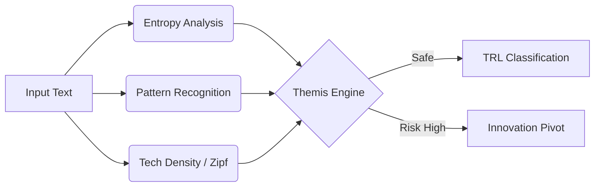

# ⚖️ Themis Engine 
### Juridical Innovation Agent

<p align="center">
  
</p>

<p align="center">
  
</p>

<p align="center">
  <a href="#"></a>
  <a href="#"></a>
  <a href="#"></a>
</p>

---

## 🌌 Overview

**Themis Engine** is not just a validator; it's a **Juridical Co-Founder**. 

Designed by [Symbeon Labs](https://github.com/symbeon-labs), this AI agent proactively analyzes technical descriptions against Brazilian Innovation Law (LPI 9.279/96) to transform "business ideas" into **patentable technological assets**.

> *"Themis doesn't just say 'NO'. It says 'PIVOT TO THIS'."*

---

## 🧠 Cognitive Capabilities

### 1. 🛡️ Risk & Patentability Detection
It analyzes text entropy, Zipfian deviation, and sensitive patterns (RegEx) to calculate an **IP Exposure Score**.



### 2. 💡 Proactive Innovation Pivots
Detects if a project falls under **Art. 10 Constraints** (Software as such) and suggests technical framings to bypass it.

| 🚫 User Input (Risk) | ✅ Themis Suggestion (Patentable) |
| :--- | :--- |
| "A software to manage sales" | "A method for distributed transaction processing" |
| "Dashboard for metrics" | "Real-time data visualization engine optimization" |

### 3. 📚 Deep Legal Context (RAG-Lite)
Powered by a curated knowledge base of:
- **LPI 9.279/96** (Industrial Property Law)
- **INPI Guidelines** for Computer Implemented Inventions
- **TRL Scales** (NASA/ABNT)

---

## 🔌 Integration (Model Context Protocol)

Themis is built as an **MCP Server**, ready to plug into Claude, Cline, or any agentic workflow.

### Quick Start

```bash
# 1. Clone & Install
git clone https://github.com/symbeon-labs/juridical-innovation-agent.git
cd juridical-innovation-agent
pip install -e .

# 2. Run Inspector to Test
npx @modelcontextprotocol/inspector python -m themis.server
```

### Configuration (`claude_desktop_config.json`)

```json
{
  "mcpServers": {
    "themis": {
      "command": "python",
      "args": ["-m", "themis.server"]
    }
  }
}
```

---

## 🛠️ Tech Stack

- **Core:** Python 3.10+
- **Protocol:** FastMCP (Model Context Protocol)
- **Reasoning:** Custom Heuristic Engine + Pattern Weights
- **Knowledge:** Markdown-based RAG

---

<div align="center">
  <sub>Built with 💙 by <b>Symbeon Labs</b> • <i>Innovation Infrastructure for the Brazilian Ecosystem</i></sub>
</div>
